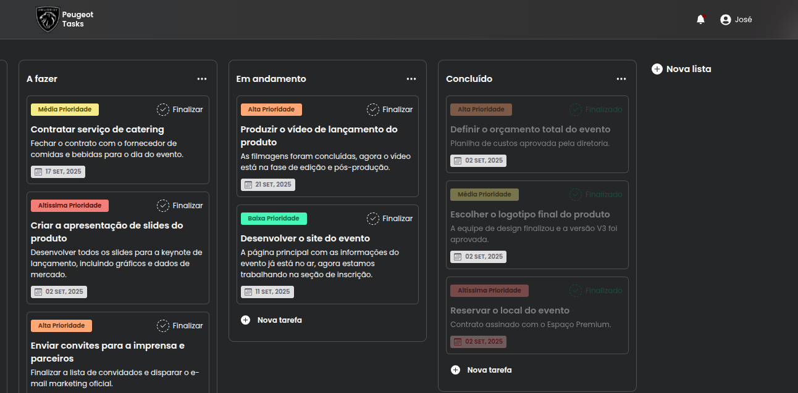

# Gerenciador de Tarefas


Um gerenciador de tarefas completo no estilo Kanban, desenvolvido como um projeto full-stack para demonstrar a integração entre um backend robusto com Spring Boot e um front-end moderno e reativo com React e TypeScript.

### Apresentação

O sistema permite que os usuários organizem suas tarefas em listas (colunas), criem, editem, finalizem e deletem tarefas, tudo com persistência de dados em um banco de dados PostgreSQL. A interface é limpa, responsiva e focada na produtividade.



---

## 🚀 Funcionalidades Implementadas

-   ✅ **Listas (Colunas):**
    -   Criação de novas listas com título.
    -   Renomeação de listas "in-loco" (clicando no título).
    -   Deleção de listas com modal de confirmação.
-   ✅ **Tarefas (Cards):**
    -   Criação de novas tarefas dentro de uma lista.
    -   Abertura de um painel lateral (drawer) para visualização e edição detalhada.
    -   Edição de título, descrição, data de conclusão e prioridade.
    -   Deleção de tarefas com modal de confirmação.
    -   Marcar tarefas como finalizadas ou não finalizadas.
-   ✅ **Interface Interativa:**
    -   Menus de opções (dropdown) para ações da lista.
    -   Notificações "Snackbar" para feedback de ações (ex: lista deletada).
    -   Layout totalmente responsivo para visualização em dispositivos móveis.
-   ✅ **Lógica de Negócio:**
    -   Validação de campos obrigatórios (título da tarefa).
    -   Destaque visual para tarefas atrasadas.
    -   Destaque visual para tarefas finalizadas (com ou sem atraso).
-   ✅ **Ambiente de Desenvolvimento:**
    -   Totalmente containerizado com Docker e Docker Compose para facilitar a execução.

---

## 🛠️ Tecnologias Utilizadas

O projeto é dividido em duas partes principais:

#### **Backend**
-   **Java 17**
-   **Spring Boot 3**
-   **Spring Data JPA / Hibernate**
-   **PostgreSQL**
-   **Maven**
-   **Lombok**

#### **Frontend**
-   **React 18** com **Vite**
-   **TypeScript**
-   **CSS Modules**
-   **Axios** para requisições HTTP
-   **date-fns** para manipulação de datas
-   **react-icons**

#### **Ambiente**
-   **Docker** e **Docker Compose**

---

## ⚙️ Como Rodar o Projeto Localmente

Com o ambiente containerizado, rodar o projeto é muito simples.

### Pré-requisitos
-   [Docker](https://www.docker.com/get-started/)
-   [Docker Compose](https://docs.docker.com/compose/install/)

### Passos para Execução

1.  **Clone o repositório:**
    ```bash
    git clone https://github.com/jpmrangel/task_manager.git
    cd task_manager
    ```

2.  **Construa as imagens Docker:**
    Este comando precisa ser executado apenas na primeira vez ou quando você alterar os `Dockerfiles` ou as dependências do projeto.
    ```bash
    docker-compose build
    ```

3.  **Inicie os containers:**
    Este comando irá iniciar o banco de dados, o backend e o frontend de uma só vez.
    ```bash
    docker-compose up
    ```

4.  **Acesse a aplicação:**
    * **Frontend (React):** [http://localhost:5173](http://localhost:5173)
    * **Backend (API Spring Boot):** [http://localhost:8080](http://localhost:8080)

5.  **Para parar a aplicação:**
    No terminal onde os containers estão rodando, pressione `Ctrl + C` e depois execute:
    ```bash
    docker-compose down
    ```
    Isso irá parar e remover os containers, mas manterá os dados do seu banco de dados salvos no volume do Docker.

---

## 📄 Endpoints da API

A API segue os padrões RESTful.

#### Listas (`/lists`)
-   `GET /lists`: Retorna todas as listas com suas respectivas tarefas.
-   `POST /lists`: Cria uma nova lista.
-   `PUT /lists/{id}`: Atualiza o nome de uma lista.
-   `DELETE /lists/{id}`: Deleta uma lista.

#### Tarefas (`/tasks`)
-   `POST /tasks`: Cria uma nova tarefa.
-   `PUT /tasks/{id}`: Atualiza os dados de uma tarefa.
-   `PATCH /tasks/{id}`: Atualiza a data de finalização de uma tarefa.
-   `DELETE /tasks/{id}`: Deleta uma tarefa.